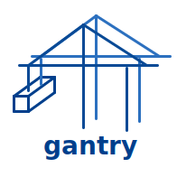

# Gantry



Tool for dynamically auto-rebuilding and re-deploying docker containers on git events triggered via webhooks.

Gantry scans your docker containers for labels, builds a config out of it and handles rebuilding and redoploying based on that.
Changes to your setup are automatically recognized and things are updated dynamically.

**THIS IS STILL IN VERY EARLY DEVELOPMENT**

## Getting started

To get started run gantry using the following docker run command

```bash
docker run \
  --name gantry \
  --label "gantry.self=true" \
  --label "gantry.user=1000" \
  --label "gantry.cwd=$PWD" \
  --label "gantry.verbose=true" \
  --label "gantry.poll_interval=30" \
  --label "gantry.ignore_not_running=true" \
  --publish "8000:8000" \
  --volume "/var/run/docker.sock:/var/run/docker.sock" \
  gantry:0.0.1
```

or use docker-compose:

```yml
version: '3.9'

services:
  gantry:
    container_name: gantry
    restart: unless-stopped
    network_mode: host
    ports:
      - '8000:8000'
    volumes:
      - /var/run/docker.sock:/var/run/docker.sock
    labels:
    - "gantry.self=true"
    - "gantry.user=1000"
    - "gantry.cwd=/home/jannik/Desktop/projects/gantry/runtime"
    - "gantry.verbose=true"
    - "gantry.poll_interval=30"
    - "gantry.ignore_not_running=true"
```

You need to have the `in-busybox.sh` script file (`runtime/in-busybox.sh`) somewhere on the host system and need to supply the folder path using the `gantry.cwd=...` label.

Label all containers which gantry should control with docker labels similar to this:

```yml
labels:
- "gantry.enable=true"
- "gantry.name=<NAME>"
- "gantry.build.method=docker"
- "gantry.build.working_directory=<docker-compose.yml FILE LOCATION>"
- "gantry.build.git_repo=<GIT REPO LOCATION>"
- "gantry.build.env_file=<OPTIONAL ENV FILE FOR COMPOSE>"
- "gantry.repo.branches=master,main"
- "gantry.webhook.method=gitea"
- "gantry.webhook.secret=<SECRET>"
```

## Documentation

For gantry itself the following labels exist:

| Label  | Default Value          | Description |
| ------ | ---------------------- | ----------- |
| `self` |                        | (**Required**) identifies the container as the gantry container |
| `user` |                        | (**Required**) user to use on host system for updating |
| `cwd`  |                        | (**Required**) folder location where `in-busybox.sh` can be found |
| `verbose` | `false`             | toggle verbose logging |
| `poll_interval` | `30`          | interval (in seconds) for checking container labels |
| `ignore_not_running` | `true`   | ignore stopped containers |

Or described as a Typescript type:

```ts
type GantrySettings = {
  user: string;
  cwd: string;
  verbose?: boolean;            /** @default false */
  poll_interval?: number;       /** @default 30 */
  ignore_not_running?: boolean; /** @default true */
}
```

As the container config would look a bit complicated as a table here is the Typescript type:

```ts
type ContainerConfig = {
  name: string,
  build: OneOf<BuildTypes>,    // how to build image
  webhook: OneOf<WebhookTypes> // how to get notified of updates
  repo?: {
    branches: string[]         // branches of interest
  }
}

type BuildTypes = {
  method: 'docker'
  working_directory: string,
  git_repo: string, // folder of git repo to pull
  env_file?: string // optional env file for docker-compose
} | {
  method: 'ansible', // not implemented yet
  working_directory: string
} | {
  method: 'command', // not implemented yet
  working_directory: string,
  command: string
}

type WebhookTypes = {
  method: 'github',
  secret: string // secret configured for the github webhook
} | {
  method: 'gitea',
  secret: string // secret configured for the gitea webhook
}
```

Converting this to labels is simple, just use dots (".") for properties of sub-objects like in the example above.

